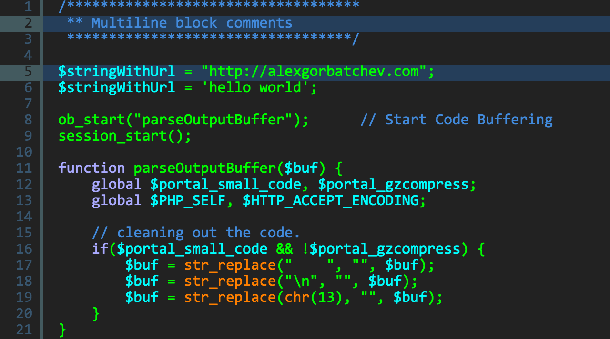

# theme-mdultra

[](https://gratipay.com/alexgorbatchev/)
[](https://travis-ci.org/syntaxhighlighter/theme-mdultra)


MDUltra theme for [SyntaxHighlighter](https://github.com/syntaxhighlighter/syntaxhighlighter).



## Installation

```
npm install theme-mdultra
```

## Usage

Please see [Building Instructions](https://github.com/syntaxhighlighter/syntaxhighlighter/wiki/Building) on the [SyntaxHighlighter Wiki](https://github.com/syntaxhighlighter/syntaxhighlighter/wiki) for details.

## Testing

```
npm test
```

## License

MIT
